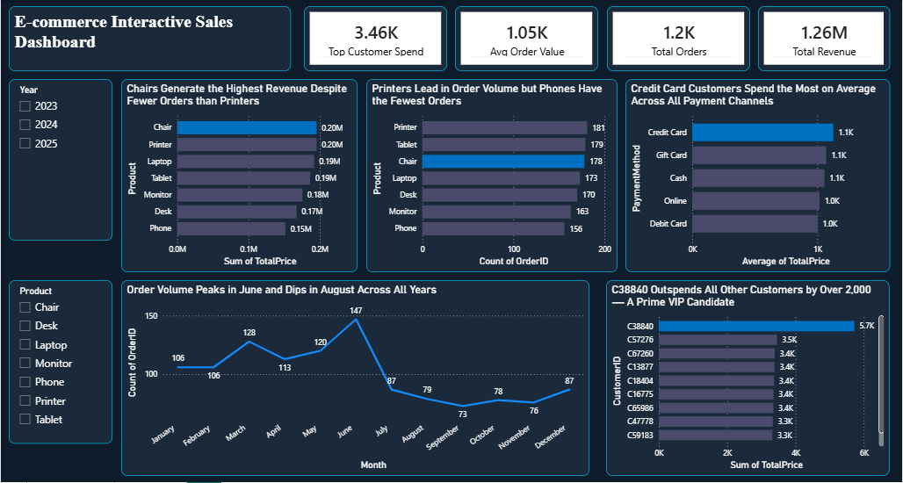

# DecodeLabs Internship – Data Analytics Projects

## 📌 Description
A collection of data analytics projects completed during my internship at DecodeLabs. 
Projects cover end-to-end analysis including data cleaning, exploratory data analysis (EDA), 
SQL querying, and interactive dashboard development.

## 🛠️ Tools & Technologies
- Microsoft Excel (Power Query, Pivot Tables)
- Microsoft SQL Server Express / Azure Data Studio
- Power BI (DAX, KPI Cards, Slicers, Dashboards)

## 📂 Projects
| Project | Description | Tools Used |
|--------|-------------|------------|
| Project 1 & 2 | Data Cleaning & Exploratory Data Analysis (EDA) | Excel |
| Project 3 | SQL Analysis on E-commerce Orders Dataset | SQL Server, Azure Data Studio |
| Project 4 | Interactive E-commerce Sales Dashboard | Power BI |

## 📊 Dashboard Preview

## 🚀 How to View
- SQL files can be opened in **Azure Data Studio** or any SQL editor
- Power BI files (.pbix) require **Power BI Desktop** (free download from Microsoft)
- Excel files open in **Microsoft Excel 2016+**

## 👩‍💻 Author
**Gloria Okoli**  
Data Analytics Intern | Statistics Graduate  
🔗 [GitHub Profile](https://github.com/Gloria-Okoli)
